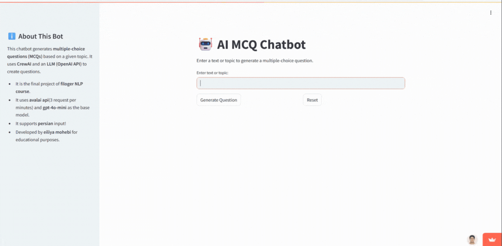

# CrewAI Quiz Chatbot 🤖

<div align="center">
  
  [](https://eiliya-mohebi.streamlit.app/)  
</div>

<div align="center">
  
</div>

A Streamlit web application that leverages CrewAI and large language model (OpenAi) to generate multiple-choice questions (MCQs) based on user-provided text or topics.

## Description

This project demonstrates the use of CrewAI to orchestrate AI agents for a specific task: generating educational content. Users can input a topic or a piece of text, and the application will generate a relevant multiple-choice question with one correct answer and three plausible distractors.

This application was developed as the final project for the Filoger NLP course.

## Features

*   **MCQ Generation:** Creates MCQs from user input (text or topic).
*   **CrewAI Integration:** Uses a CrewAI agent specifically designed for MCQ generation.
*   **LLM Powered:** Leverages OpenAI's API (specifically configured via environment variables, potentially using models like `gpt-4o-mini` via custom endpoints like `avalai`).
*   **Interactive UI:** Built with Streamlit for a user-friendly web interface.
*   **Answer Checking:** Allows users to select an answer and verifies if it's correct.
*   **Persian Support:** Can handle input in Persian.
*   **Customizable LLM:** Uses environment variables to set the API base URL and model name.

## Live Demo

The app is deployed and accessible as a Streamlit web application:

[https://eiliya-mohebi.streamlit.app/](https://eiliya-mohebi.streamlit.app/)

## Tech Stack

*   **Python:** Core programming language.
*   **Streamlit:** Web application framework.
*   **CrewAI:** AI agent framework.
*   **Langchain:** Utilized by CrewAI for LLM interactions (`ChatOpenAI`).
*   **OpenAI API:** Powers the question generation (can be configured for different providers/models).
*   **dotenv:** For managing environment variables.

## Setup and Installation

1.  **Clone the repository:**
    ```bash
    git clone https://github.com/eiliya-mohebi/crewai-quiz-chatbot.git
    cd crewai-quiz-chatbot
    ```

2.  **Create a virtual environment:**
    ```bash
    python -m venv venv
    source venv/bin/activate # On Windows use `venv\Scripts\activate`
    ```

3.  **Install dependencies:**
    ```bash
    pip install -r requirements.txt
    ```

4.  **Set up environment variables:**
    Create a `.env` file in the project's root directory and add the necessary API keys and configurations:
    ```env
    OPENAI_API_KEY="your_openai_or_avalai_api_key"
    OPENAI_API_BASE="your_api_base_url" # e.g., https://api.avalai.com/v1
    OPENAI_MODEL_NAME="your_model_name" # e.g., gpt-4o-mini
    ```
    Replace the placeholder values with your actual credentials and desired model/endpoint.

## Usage

Run the Streamlit application:

```bash
streamlit run crewai-quiz-chatbot/main-crew.py
```

Open your web browser and navigate to the local URL provided by Streamlit (usually `http://localhost:8501`). Enter a topic or text in the input field and click "Generate Question".

## How It Works

1.  The user enters text or a topic via the Streamlit interface.
2.  Clicking "Generate Question" triggers the `generate_mcq` function.
3.  A `ChatOpenAI` instance is initialized using the settings from the `.env` file.
4.  A CrewAI `Agent` is defined with the specific role, goal, and backstory for generating MCQs.
5.  A CrewAI `Task` is created, instructing the agent to generate an MCQ based on the user's input, specifying the desired output format (a tuple containing the question string and a dictionary of options).
6.  A `Crew` is formed with the agent and task, and the `kickoff` method is called.
7.  The LLM generates the MCQ based on the agent's instructions.
8.  The raw output from the crew is parsed (using `ast.literal_eval`) into the expected tuple format.
9.  The question and options are stored in the Streamlit session state and displayed to the user.
10. The user can select an answer and click "Submit Answer" to check if it's correct.

## Acknowledgments

*   Developed by **eiliya mohebi**.
*   Created as part of the **Filoger NLP course**.
